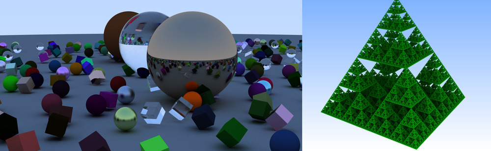

<!--- ------------------------------------------------------- -->
What is OWL?
============

OWL is a OptiX 7 based library that aims at providing some of the
convenience of OptiX 6's Node Graph API on top of OptiX 7. This aims
at making it easier to port existing OptiX 6-style applications over
to OptiX 7, and, in particular, to make it easier to get started with
OptiX 7 even without having a full grasp of things like Shader Binding
Tables, Multi-GPU rendering, etc.

OWL is still in early stages, which means that it as yet lacks many of
the features that OptiX 6 offered, and in particular, that many things
are still changing rather rapidly; however, it already contains
several working mini-samples, so at the very least should allow to
serve as a "show-and-tell" example of how to set up a OptiX 7
pipeline, how to build acceleration structures, how to do things like
compaction, setting up an SBT, etc.

Key links:

- For latest code on github: [https://github.com/owl-project/owl](https://github.com/owl-project/owl)

- For a brief (visual) overview over latest samples: [http://owl-project.github.io/Samples.html](http://owl-project.github.io/Samples.html)

