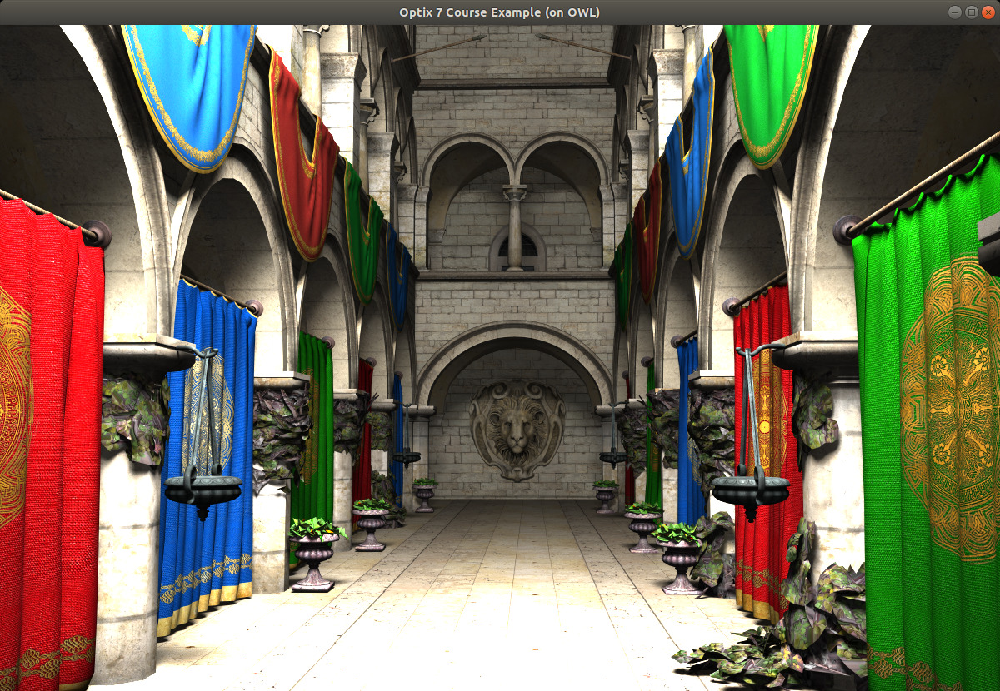
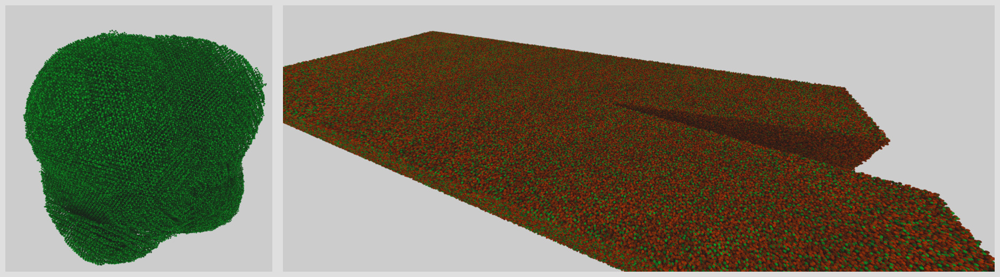

# OWL - News / Updates

<!-- ======================================================= -->
## Nov 8, 2020 - first public "introduction" of OWL on my Blog

Though OWL has been mentioned previously in various places, yesterday
OWL was - for the first time - introduced as now being public, stable,
and ready-to-use.

<!-- ======================================================= -->
## Oct 25-30 - OWL-based "ExaBricks" paper at IEEE Vis

This week at IEEE Vis we presented our "ExaBricks" paper on 
AMR data rendering, written completely in OWL: 
https://www.willusher.io/publications/exabrick

  {.widepic}

<!-- ======================================================= -->
## Oct 17, 2020 - first "Version 1.0" 

After fixing the last few bugs and feature requests that stood in the
way of doing so, OWL has finally been tagged as the first official,
complete, stable release ... V1.0

<!-- ======================================================= -->
## Jan 7, 2020 - first prototype with (most of) optix7course OBJ viewer

As of just a few minutes ago, OWL has passed another milestone in that
I just managed to port the course tutorial from our Siggraph 2019
course on optix 7 ([original code at
https://github.com/ingowald/optix7course](https://github.com/ingowald/optix7course))
to also work on OWL. 

There's still a two caveats with this code, namely that OWL does not
yet that I do not yet expose denoising, and that it does not yet
support a native "OWLTexture" type; both of which the final example in
that course tutorial relied upon. For denoising, there was (as yet) no other
way but to disable denoising in this sample; for texturing, however, I
could actually use the existing CUDA based texture code, and simply upload
the cudaTextureObject's as SBT data, so texturing does actually work. 

There were several bugs discovered in this sample, and quite a few
more missing pieces than expected (eg, I had to add support for
multiple ray types, multiple miss programs, variables for user types,
and a lot of bug fixes); on the upside, the resulting code is (as
hoped) significnatly simpler than the original one, and the current
use of CUDA textures is a nice demonstration of how easy it is to do
"CUDA interop".

Code will need some more cleanup before release, but first sample pic
here:

[{.widepic}](png/optix7course-on-owl.png)

<!-- ======================================================= -->
## Dev 29, 2019 - v0.5.3 with first RTOW example on Node Graph Layer

Node graph layer shows first signs of life, now supporting the full
"RTOW" ([Ray Tracing in One Weekend](https://www.realtimerendering.com/raytracing/Ray%20Tracing%20in%20a%20Weekend.pdf])) sample.

For a (very) rough idea of how the node graph API works, see
  [this brief walk-through through the `ng05-rtow` sample](ng-api-overview.html).

<!-- ======================================================= -->
## Dev 25, 2019 - v0.5.2 and first successful app-port

- v0.5.2 adds first part of node graph layer, with `ng01-simpleTriangles`
  example that ported `ll01-simpleTriangles` to node graph layer API
  (many ng parts still missing - so far only triangle geometry working)
  
- successfully ported first 'external' app over to owl-ll: The app shown
  here is a pkd-tree based particle viewer initially written on OptiX 6, and
  now ported to OptiX 7 view the owl-ll layer. The pictures show two data
  sets (a 'supersoot' particle and a crack simulation) also referenced in
  [http://www.sci.utah.edu/~wald/Publications/2015/pkd/pkd.pdf](http://www.sci.utah.edu/~wald/Publications/2015/pkd/pkd.pdf)

[{.widepic}](png/rtxpkd.png)

<!-- ======================================================= -->
## Dec 19, 2019 - First Public Version on Github

- pushed version 0.5.0; still very early, but ll-api layer's version
  of "Ray Tracing in One Weekend" working reliably on both Linux and
  Windows.

<!-- ======================================================= -->
## Dec 16, 2019 - First Draft of Web Page

- this is the beginning of this new feed ...

