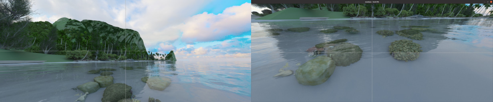
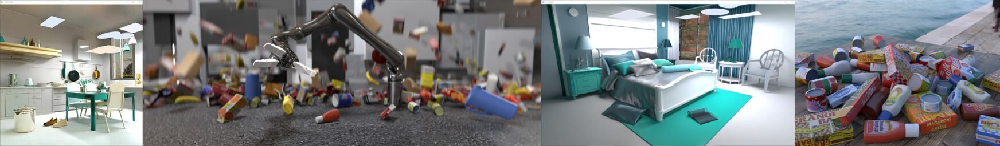
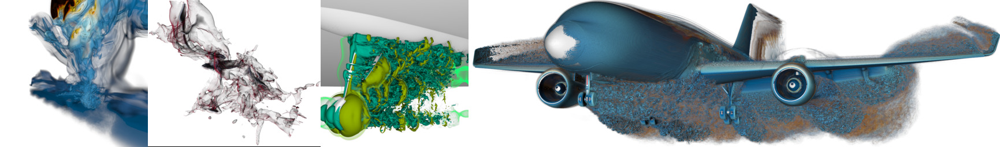
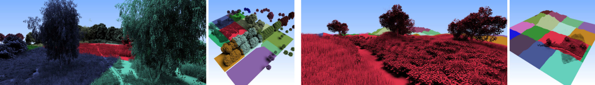
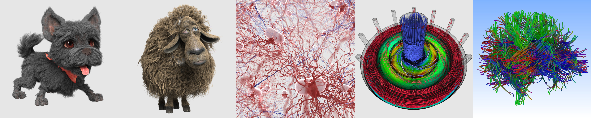

# Samples

## Some sample use projects/papers that recently used OWL:

- Moana on OWL/OptiX (Oct 2020)

  (https://ingowald.blog/2020/10/26/moana-on-rtx-first-light/)

  {.widepic}
  
- "VisII - A Python-Scriptable Virtual Scene Imaging Interface (2020)

  (https://github.com/owl-project/ViSII)

  {.widepic}
  
- "Ray Tracing Structured AMR Data Using ExaBricks". I Wald, S
  Zellmann, W Usher, N Morrical, U Lang, and V Pascucci. IEEE
  TVCG(Proceedings of IEEE Vis
  2020).
  
  (https://www.willusher.io/publications/exabrick)
  
  {.widepic}
  
- "Accelerating Force-Directed Graph Drawing with RT Cores".  S
  Zellmann, M Weier, I Wald, IEEE Vis Short
  Papers 2020.
  
  (https://arxiv.org/pdf/2008.11235.pdf)
 
 
 - "A Virtual Frame Buffer Abstraction for Parallel Rendering of Large
  Tiled Display Walls". M Han, I Wald, W Usher, N Morrical, A Knoll, V
  Pascucci, C R Johnson. IEEE Vis Short Papers 2020.
  
  (http://www.sci.utah.edu/~wald/Publications/2020/dw2/dw2.pdf)
 
- "Spatial Partitioning Strategies for Memory-Efficient Ray Tracing of
  Particles".  P Gralka, I Wald, S Geringer, G Reina, Th Ertl. IEEE
  Symposium on Large Data Analysis and Viusalization (LDAV) 2020.
 
- "Finding Efficient Spatial Distributions for Massively Instanced 3-d
  Models".  S Zellmann, N Morrical, I Wald, V Pascucci.  Eurographics
  Symposium on Parallel Graphics and Visualization (EGPGV 2020).
  
  (https://vis.uni-koeln.de/forschung/publikationen/finding-efficient-spatial-distributions-for-massively-instanced-3-d-models)
 
  {.widepic}
 
- "High-Quality Rendering of Glyphs Using Hardware-Accelerated Ray
  Tracing".  S Zellmann, M Aumüller, N Marshak, I Wald.  Eurographics
  Symposium on Parallel Graphics and Visualization (EGPGV 2020).
  
  (https://vis.uni-koeln.de/forschung/publikationen/high-quality-rendering-of-glyphs-using-hardware-accelerated-ray-tracing)

  {.widepic}
  
- "RTX Beyond Ray Tracing: Exploring the Use of Hardware Ray Tracing
  Cores for Tet-Mesh Point Location". I Wald, W Usher, N Morrical, L
  Lediaev, and V Pascucci.  In High Performance Graphics Short Papers,
  2019 
  
  (https://www.willusher.io/publications/rtx-points)

- "Using Hardware Ray Transforms to Accelerate Ray/Primitive
  Intersections for Long, Thin Primitive Types". I Wald, N Morrical, S
  Zellmann, L Ma, W Usher, T Huang, V Pascucci.  Proceedings of the
  ACM on Computer Graphics and Interactive Techniques (Proceedings of
  High Performance Graphics), 2020
  
  (https://www.willusher.io/publications/owltubes)

- "Efficient Space Skipping and Adaptive Sampling of Unstructured
  Volumes Using Hardware Accelerated Ray Tracing. N Morrical, W
  Usher, I Wald, V Pascucci. In IEEE VIS Short Papers, 2019
  
  (https://www.willusher.io/publications/rtx-space-skipping)

<!-- ======================================================= -->
# OWL's own "Tutorial-Style" Samples

The OWL repo itself contains a list of samples intended to only
highlight/demonstrate certain individual technologies such as how to
create a group, how to do multi-level instancing, etc. Here a overview
over some of those:

<!-- ======================================================= -->
### `ll08-sierpinski`

The latest sample, demonstrating multi-level instancing:

- One geometry that contains exactly one pyramid

- N levels of instances, each of which creates four shifted and scaled
  instances of the previous level

- Number of levels configurable via command-line, via `--num-levels <N>`

{.samplepic}

<!-- ======================================================= -->
### `ll07-groupOfGroups`

{.samplepic}

<!-- ======================================================= -->
### `ll06-rtow-mixedGeometries`

- Extends `ll05` by replacing some of the spheres with boxes

- Boxes are realized as triangle meshes, and organized in
  three different geometries (again, once per material).

- To support both boxes and user geometries this sample is the first
  to use two *different* groups (one triangle group, one user geom
  group)

- In this sample, device-code traces into the two different groups
  sequentially, then picks the closer of the two hitpoints

{.samplepic}

<!-- ======================================================= -->
### `ll05-rtow`

- The first-ever "real" example that re-implements Ingo Wald
  original OptiX-6 based "Ray Tracing in one Weekend" example
  with OWL.

- Three different CH programs - one each for Lambertian, Metal, and Dielectric.

- Spheres are organized in three different geometry groups (one per
  material type), each of which has multiple spheres.

- Material parameters are stored per-material, in a buffer per each
  geometry (i.e., the Lambertian spheres geom has a buffer of Lambertian
  material data, etc).

{.samplepic}

<!-- ======================================================= -->
### `ll04-userGeometry-boundsProg`

- Similar to ll03, except that bounds are computed via a bounding box *program*

- Bounds program specified in the device-program, and added to the
  user geometry type, then automatically run on device (on
  owl-allocated memory) when the accel structure needs rebuild (same
  as OptiX 6 bounds program).
  
{.samplepic}

<!-- ======================================================= -->
### `ll03-userGeometry-boundsBuffer`

- Replaces the triangle meshes in ll02 with user geometry

- User geometry uses an intersection program to implement a sphere shape

- in this sample, bounding box information for user geoms is passed
  via a (host-supplied) buffer of precomputed bounding boxes

{.samplepic}

<!-- ======================================================= -->
### `ll02-multipleTriangleGroups`

- Replaces single box with eight different ones

- Each box is its own triangle mesh, with its own SBT entry

- SBT entry stores the material data, closest-hit shader pulls this to
shade boxes with different colors.

- Still one accel that contains all eight meshes

{.samplepic}

<!-- ======================================================= -->
### `ll01-simpleTriangles`

This was the very first sample ever implemented for OWL (at a time
when OWL could do exactly this sample, and nothing else).

Key features:

- a single triangle mesh (the box) with a single SBT entry

- a single bottom-level acceleration structure

- a minimalistic miss program that uses launch index to compute the
  black-and-red-squares pattern

- a closest-hit program that computes geometry normal and dot N-dot-D shading.

{.samplepic}
