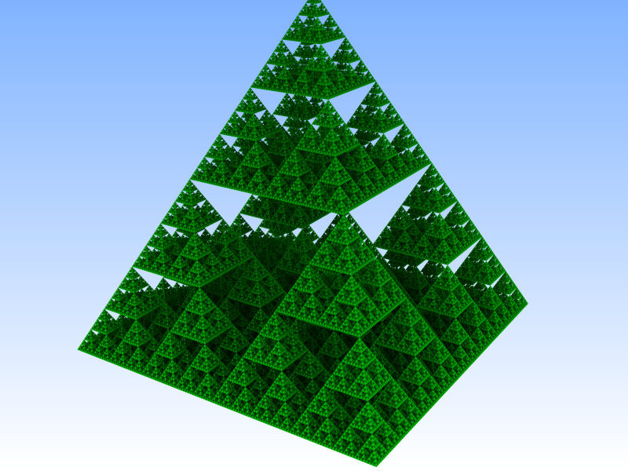
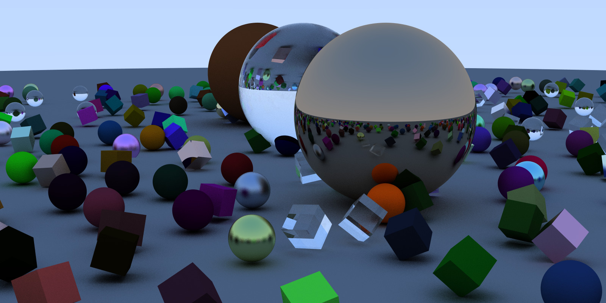
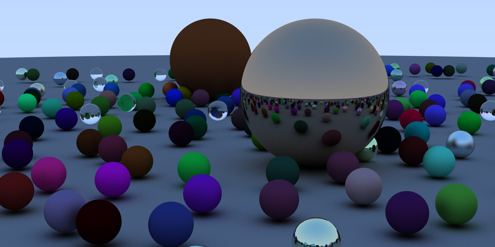
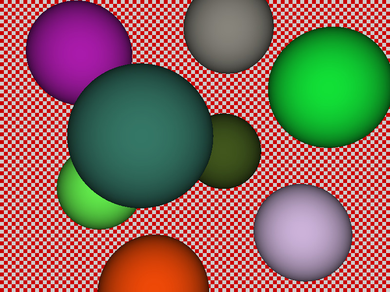
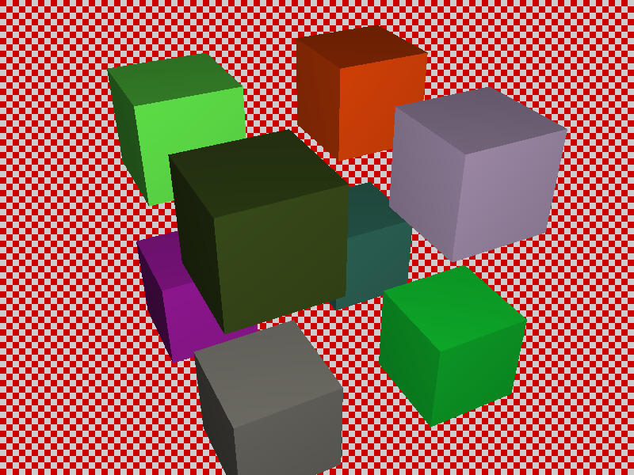
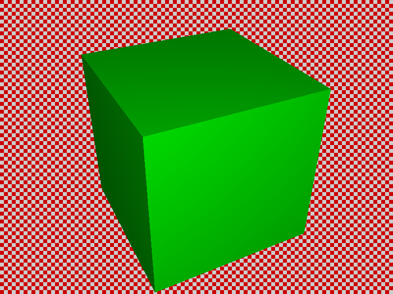

# Samples

OWL comes with a set of successively more complex samples to aid in
understanding how to use the OWL API.

<!-- ======================================================= -->
## `ll08-sierpinski`

The latest sample, demonstrating multi-level instancing:

- One geometry that contains exactly one pyramid

- N levels of instances, each of which creates four shifted and scaled
  instances of the previous level

- Number of levels configurable via command-line, via `--num-levels <N>`

<!-- ======================================================= -->
## `ll07-groupOfGroups`

<!-- ======================================================= -->
## `ll06-rtow-mixedGeometries`

- Extends `ll05` by replacing some of the spheres with boxes

- Boxes are realized as triangle meshes, and organized in
  three different geometries (again, once per material).

- To support both boxes and user geometries this sample is the first
  to use two *different* groups (one triangle group, one user geom
  group)

- In this sample, device-code traces into the two different groups
  sequentially, then picks the closer of the two hitpoints

<!-- ======================================================= -->
## `ll05-rtow`

- The first-ever "real" example that re-implements ingowald's
  original optix-6 based "Ray Tracing in one Weekend" example
  with OWL.

- Three different CH programs - one each for lambertian, metal, and dielectric.

- Spheres are organized in three different geometry groups (one per
  material type), each of which has multiple spheres

- Material parameters are stored per-material, in a buffer per each
  geometry (ie, the lambertian spheres geom has a buffer of lambertian
  matial data, etc)

<!-- ======================================================= -->
## `ll04-userGeometry-boundsProg`

- Similar to ll03, except that bounds are computed via a bounding box *program*

- Bounds program specified in the device-program, and added to the
  user geometry type, then automatically run on device (on
  owl-allocated memory) when the accel structure needs rebuild (same
  as Optix 6 bounds program).
  

<!-- ======================================================= -->
## `ll03-userGeometry-boundsBuffer`

- Replaces the triangle meshes in ll02 with user geometry

- User geometry uses an intersection program to implement a sphere shape

- in this sample, bounding box information for user geoms is passed
  via a (host-supplied) buffer of precomputed bounding boxes

<!-- ======================================================= -->
## `ll02-multipleTriangleGroups`

- Replaces single box with eight different ones

- Each box is its own triangle mesh, with its own SBT entry

- SBT entry stores the material data, closest-hit shader pulls this to
shade boxes with different colors.

- Still one accel that contains all eight meshes

<!-- ======================================================= -->
## `ll01-simpleTriangles`

This was the very first sample ever implemented for OWL (at a time
when OWL could do exactly this sample, and nothing else).

Key features:

- a single triangle mesh (the box) with a single SBT entry

- a single bottom-level acceleration structure

- a minimalistic miss program that uses launch index to compute the
  black-and-red-squares pattern

- a closest-hit program that computes geometry normal and dot N-dot-D shading.

